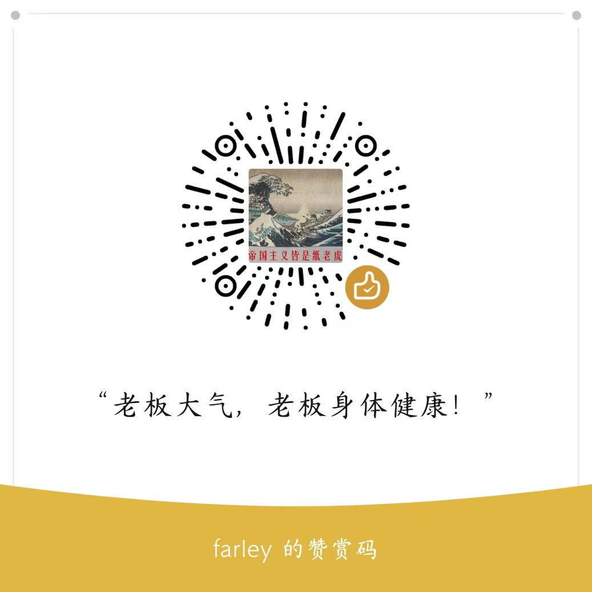

# 2022年SANS系列峰会内容

## 郑重说明

SANS系列峰会经常会出现以美国为核心的政治意识形态的内容！

本项目整理和归档的目的是在于技战术、动态和思路，与政治意识形态无关！

2022年SANS的系列峰会，将视频、演讲者内容、简历、社交媒体、关联网站、使用工具都按照主题归档，感兴趣的朋友可以关注并来个**star**！

## 01-2022 SANS Cyber Threat Intelligence Summit

- 时间：January 27 & 29, 2022

### 演讲主题

00-SANS相关合集😎

01-You Get What You Ask For: Building Intelligent Teams for CTI Success-😀Melanie Kruger, Katie Nickels

02-Keynote: Journey to the Center of CTI-😀Rebekah Brown

03-Inside the Persistent Mind of a Chinese Nation-State Actor-😀Lina Lau

04-Tecnología, Expresividad y Contexto en la Observación de Amenazas-😀Carlos Diaz

05-Is Sharing Caring? A Deeply Human Study on CTI Networking-😀Grace Chi

06-Práctico uso de Inteligencia De Amenazas para operacionalizar Purple Teaming-😀JorgeOrchilles,Nathali Cano

07-We're in Now, Now-😀Sherman Chu

08-Mind Your Gaps-😀Brian Mohr

09-Keynote: Use Your Voice-😀Lillian Teng

10-Data Sources 2.0: Operacionalizando los nuevos objetos del marco ATT&CK-😀Jose & Roberto Rodriguez

11-DeadRinger: Three APTs Walk Into A Bar..-😀Assaf Dahan, Tom Fakterman, Daniel Frank

12-Usando MITRE dentro del ciclo de inteligencia-😀Marc Rivero Lopez

13-Clip Addiction: A Threat Intelligence Approach to Video-Based Chinese InfoOps-😀 Che Chang, Silvia Yeh

14-La Evolución del Ransomware: Previsión de Escenarios Posibles para 2022-😀Stefano De Blasi

15-Applied Forecasting-😀Jan Bruggink

16-La Evolución del Ransomware: Previsión de Escenarios Posibles para 2022-😀Stefano De Blasi

17-TypoDetect, Detectando trampas para engañar tu cerebro-😀Diego Espitia

18-Técnicas CTI para la caracterización de un ataque con ransomware-😀 Nounou Mbeiri, Iván Portillo

19-Mark Your Calendars: Why Dates Matter to Adversaries-😀 Nate Beach-Westmoreland

20-Building Strategic Return on Investment Through Cyber Intelligence-😀Bethany May, Oralia Rodriguez

21-Integrated Intelligence-😀Samara Williams

## 02-2022 SANS OSINT Summit

- 时间：April 7, 2022

### 演讲主题

00-SANS 相关链接

01-I Know You

02-Dark Web: The Other Side

03-Finding Frausters Who Hide Behind Cloudflare

04-Lessons Learned From Ten Years of OSINT Automation

05-Open House

06-Protecting High-Value Individuals

07-Glass Bottom OSINT

08-Blockchain Investigations 101

09-How to Investigate Phishing Campaigns

10-What Value Does OSINT Bring to the Web 3.0 Space?

11-Once Upon a Crime: A Novel Approach to OSINT Through Storytelling

12-Ad Analytics and Marketing SEO Tools as a Resource for OSINT Investigations

13-OSINT & AI

### 交付物

- markdown
- 书签

## 关于我们

赤旗情报团队目前有3位同学共同创作与运营，共同以网络空间威胁情报为核心进行理论和实践的研究。

博客：3dline.xyz

